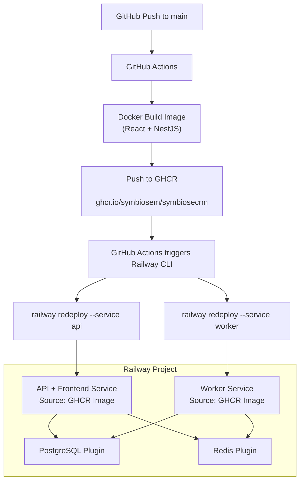
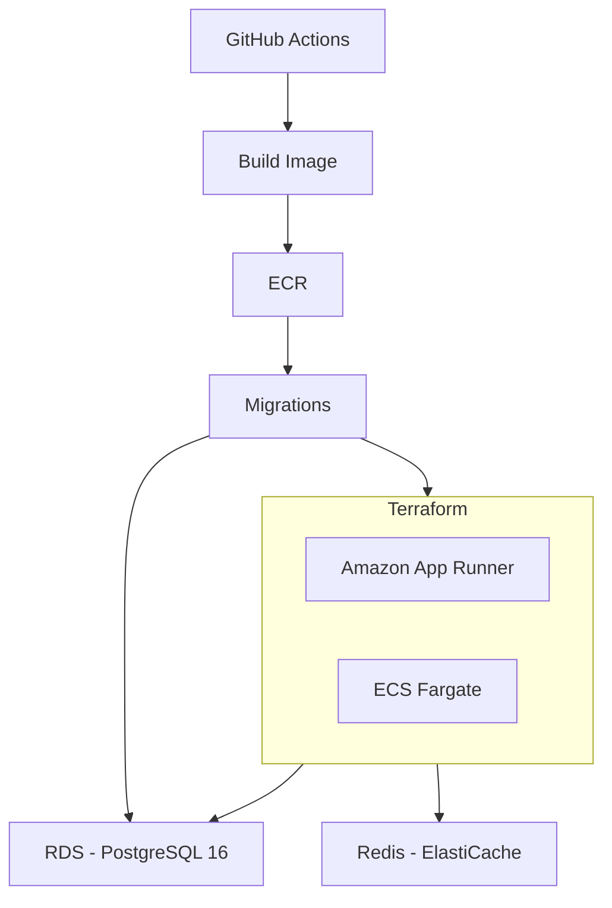

# CRM Deploy Flow



## Prerequisites (one-time setup)

- Bootstrap infrastructure (S3 backend + DynamoDB lock)
- ECR repository created (manual or via bootstrap Terraform)
- GitHub Secrets configured (DB, Redis, API keys)
- GitHub OIDC configured with AWS IAM role
- Route53 hosted zone (if using custom domain)

## AWS Managed Services

PostgreSQL and Redis are not deployed as containers in production. They run as AWS managed services, provisioned via Terraform before the first deploy.

### Amazon RDS (PostgreSQL)

- Engine: PostgreSQL 16
- Required extensions (enabled on first run via `setup-db.ts`):
  - `uuid-ossp` — supported natively by RDS
  - `unaccent` — supported natively by RDS
- `IS_FDW_ENABLED` must remain unset or `false` — the FDW extensions (`wrappers`, `mysql_fdw`) are not supported by RDS and are not needed for this CRM
- The DB instance must be accessible from both App Runner and ECS Fargate (VPC + security group configuration)

### Amazon ElastiCache (Redis)

- Engine: Redis (standard mode, not cluster mode)
- Required parameter: `maxmemory-policy = noeviction` — critical for BullMQ to prevent job loss when memory is full
- Used for: caching, session storage, background job queues (BullMQ), GraphQL subscriptions (SSE via pub/sub), distributed locking
- A single ElastiCache instance is sufficient (`REDIS_URL`); `REDIS_QUEUE_URL` is optional for a dedicated queue instance

## Deployment Flow Diagram



## Compute Architecture

The application runs as two separate processes from the **same Docker image**:

### App Runner — API + Frontend

- Serves the NestJS API and the React frontend (static files from `dist/front`)
- Entrypoint runs DB migrations (unless `DISABLE_DB_MIGRATIONS=true`) and registers cron jobs
- Scales automatically based on incoming HTTP traffic
- Health check on `/health`
- Real-time features use **Server-Sent Events (SSE)** over standard HTTP — no WebSocket upgrade required, fully compatible with App Runner

### ECS Fargate — BullMQ Worker

The application uses BullMQ extensively for background job processing. There are **16 queues** and **63+ job processors** handling messaging, calendars, webhooks, workflows, billing, contact creation, and more. This requires a **dedicated worker process** separate from the API.

- Same Docker image as App Runner, different command: `node dist/queue-worker/queue-worker`
- Entry point: `packages/twenty-server/src/queue-worker/queue-worker.ts`
- Processes all BullMQ jobs from Redis queues (no HTTP traffic)
- Runs as a long-lived ECS service (`desired_count = 1`; BullMQ handles concurrency internally)
- Environment variables: `DISABLE_DB_MIGRATIONS=true`, `DISABLE_CRON_JOBS_REGISTRATION=true` (crons are registered by App Runner)

**Why ECS Fargate instead of a second App Runner?**
App Runner scales based on HTTP requests — the worker receives no HTTP traffic, it polls Redis queues. Fargate is designed for long-running processes and does not require an HTTP health check endpoint.

## Networking (VPC Connector)

App Runner requires a **VPC Connector** to reach RDS and ElastiCache in private subnets. ECS Fargate tasks run directly within VPC subnets.

The `networking` module is optional and can be activated when the VPC is configured in AWS. The App Runner module accepts a `vpc_connector_arn` variable (empty by default) so the Terraform code is ready without requiring the VPC to exist on day one.

> **Note:** For initial staging setup, RDS and ElastiCache can be temporarily configured with public access. For production, private subnets with proper security groups are required.

## GitHub Actions — CI (on each PR)

1. Checkout code
2. Setup Node + cache Yarn
3. Install dependencies
4. Lint (`npx nx affected:lint --base=origin/main`)
5. Typecheck (`npx nx affected:typecheck --base=origin/main`)
6. Build verification (`npx nx affected:build --base=origin/main`)

## GitHub Actions — CD (per environment)

> This flow applies to any environment (staging, production, etc.).
> Each environment runs it with its own configuration values (DB, image_uri, Terraform workspace, etc.).
> **Recommended:** promote the same image from staging to production (re-tag, don't rebuild) to guarantee parity.

### Job 1: Build and Push

1. AWS Login (OIDC, role assumption)
2. Build Docker image (context: root, dockerfile: `packages/twenty-docker/twenty/Dockerfile`)
   - Multi-stage build: compiles frontend and backend into a single image
   - Frontend is served as static files from the backend (`dist/front`)
   - One ECR repository — no separate repos for PostgreSQL or Redis
3. Tag: `sha-<7chars>_<env>` (e.g. `abc1234_staging`, `abc1234_production`)
4. Push image to ECR
5. Output: `image_uri` (e.g. `<account>.dkr.ecr.us-east-1.amazonaws.com/twenty-server:abc1234_staging`)

### Job 2: Manual Approval

- Uses GitHub Environment protection rules
- Gate before any changes are applied to the target environment

### Job 3: Run DB Migrations

1. Run a one-off ECS Fargate task using the newly pushed image
   - Command: uses the default entrypoint with migrations enabled (`DISABLE_DB_MIGRATIONS` unset)
   - Executes `setup-db.ts` (if first run) + `yarn command:prod upgrade`
2. Wait for task completion
3. If the migration fails, the pipeline stops — the image is not deployed
4. Migrations must be backward-compatible (old and new instances run in parallel during rollout)

### Job 4: Deploy (Terraform)

1. `terraform init`
2. `terraform plan -var="image_uri=$IMAGE_URI" -var="env=$ENV"`
   - Updates **both** App Runner service and ECS Fargate task definition
3. `terraform apply -auto-approve`
4. Wait for App Runner deployment to complete (30–60s)
5. Wait for ECS service to reach steady state

### Job 5: Verify

1. Smoke test: `curl $SERVICE_URL/health`
2. If the health check fails, roll back by running `terraform apply` with the previous `image_uri`
3. Notify result (Slack/email)

## Environment Variables

### Shared (App Runner + Fargate Worker)

| Variable | Description |
|----------|-------------|
| `DATABASE_URL` | RDS PostgreSQL connection string |
| `REDIS_URL` | ElastiCache Redis URL |
| `SERVER_URL` | Public URL of the App Runner service |
| `FRONT_BASE_URL` | Same as `SERVER_URL` (frontend served from backend) |
| `APP_SECRET` | Secret for JWT and session management |
| `STORAGE_TYPE` | `s3` |
| `STORAGE_S3_REGION` | AWS region for S3 bucket |
| `STORAGE_S3_NAME` | S3 bucket name |
| `IS_FDW_ENABLED` | `false` (FDW not supported on RDS) |

### App Runner only

| Variable | Value | Reason |
|----------|-------|--------|
| `PORT` | `8080` | Required by App Runner |
| `DISABLE_DB_MIGRATIONS` | `true` | Migrations run in a separate CD step |

### Fargate Worker only

| Variable | Value | Reason |
|----------|-------|--------|
| `DISABLE_DB_MIGRATIONS` | `true` | Migrations run in a separate CD step |
| `DISABLE_CRON_JOBS_REGISTRATION` | `true` | Cron jobs are registered by the App Runner instance |

## Terraform Structure

```
infra/
├── bootstrap/
│   ├── main.tf                # S3 backend, DynamoDB lock, ECR repository
│   └── README.md
├── modules/
│   ├── app-runner/
│   │   ├── main.tf            # App Runner service, IAM roles, auto-scaling
│   │   ├── variables.tf
│   │   └── outputs.tf
│   ├── worker/
│   │   ├── main.tf            # ECS cluster, task definition, service, IAM roles, CloudWatch logs
│   │   ├── variables.tf
│   │   └── outputs.tf
│   └── networking/            # Optional — activate when VPC is configured
│       ├── main.tf            # VPC Connector, security groups
│       ├── variables.tf
│       └── outputs.tf
├── staging/
│   ├── main.tf                # Calls app-runner + worker modules
│   ├── backend.tf
│   └── terraform.tfvars
└── production/
    ├── main.tf                # Calls app-runner + worker modules
    ├── backend.tf
    └── terraform.tfvars
```

## Implementation Phases

| Phase | Scope | Estimate | Cumulative |
|-------|-------|----------|------------|
| 1 | Bootstrap (S3, DynamoDB, ECR, OIDC) + CI pipeline | 2 days | 2 days |
| 2 | App Runner on staging + RDS + ElastiCache | 3 days | 5 days |
| 3 | ECS Fargate worker on staging + CD pipeline | 3 days | 8 days |
| 4 | Networking hardening + production deploy | 2 days | 10 days |

**Total estimated effort: 2 weeks**

### Phase 1: Bootstrap + CI

- Terraform bootstrap (S3 backend, DynamoDB lock, ECR repository)
- GitHub OIDC + IAM role for Actions
- CI workflow: lint, typecheck, and build with `nx affected`
- Verify Docker image builds successfully

**Deliverable:** PRs run through CI automatically. Docker image can be built and pushed to ECR.

### Phase 2: App Runner on Staging

- Terraform module `app-runner/`
- Provision RDS PostgreSQL and ElastiCache Redis for staging
- Configure environment variables in SSM / Secrets Manager
- Deploy `staging/main.tf` and validate the application serves frontend, API, and `/health`

**Deliverable:** CRM running on staging (without worker or automated CD).

### Phase 3: Worker + CD Pipeline

- Terraform module `worker/` (ECS cluster, task definition, service)
- IAM roles, CloudWatch log group, security groups
- GitHub Actions CD workflow (build → approval → migrate → deploy → verify)
- Validate BullMQ jobs are processed (webhooks, messaging, cron jobs)

**Deliverable:** Full application running on staging with automated deployments.

### Phase 4: Networking + Production

- Terraform module `networking/` (VPC Connector, security groups)
- Move RDS and ElastiCache to private subnets
- Production environment (`production/main.tf` + `terraform.tfvars`)
- Custom domain + ACM certificate + Route53
- Rollback runbook documented

**Deliverable:** CRM live in production with secure networking and automated CI/CD.
