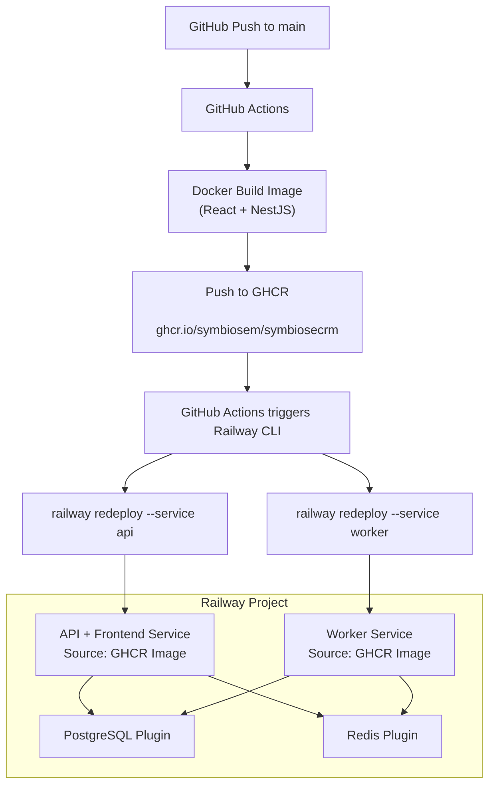

# CRM Deploy Flow — Railway

## Prerequisites (one-time setup)

- Railway account (Pro plan recommended — Hobby plan has execution limits)
- Railway CLI installed (`npm install -g @railway/cli`) and authenticated (`railway login`)
- Railway project created with API service, Worker service, PostgreSQL plugin, and Redis plugin
- Railway API token generated (for GitHub Actions) — stored as `RAILWAY_TOKEN` in GitHub Secrets
- Railway service IDs for API and Worker — stored as `RAILWAY_API_SERVICE_ID` and `RAILWAY_WORKER_SERVICE_ID` in GitHub Secrets
- Custom domain DNS access (if applicable)

> **Note:** The GitHub repository is NOT connected directly to Railway. All deployments are triggered via GitHub Actions using the Railway CLI. Railway never has access to the source code — it only receives the built Docker image.

## Railway Managed Services

PostgreSQL and Redis run as Railway plugins, provisioned directly from the Railway dashboard alongside the application services.

### Railway PostgreSQL

- Engine: PostgreSQL (version managed by Railway)
- Required extensions (`uuid-ossp`, `unaccent`): supported natively — enabled on first run via `setup-db.ts`
- `IS_FDW_ENABLED` must remain unset or `false` — FDW extensions are not needed for this CRM
- Connection string provided automatically as `DATABASE_URL` environment variable

### Railway Redis

- Engine: Redis (standard mode)
- Required parameter: `maxmemory-policy = noeviction` — must be configured manually via Railway Redis plugin settings. Critical for BullMQ to prevent job loss when memory is full
- Used for: caching, session storage, background job queues (BullMQ), SSE pub/sub, distributed locking
- Connection string provided automatically as `REDIS_URL` environment variable
## Deployment Flow Diagram (GHCR Pipeline)

> **Key Achievement:** To prevent Railway from running out of memory and timing out during the heavy 25+ minute Monorepo build, we shifted the build process to GitHub Actions. The application is now compiled into a Docker image automatically on GitHub's servers (taking < 5-10 minutes with caching) and pushed to the GitHub Container Registry (GHCR). Railway only fetches the pre-built image, reducing deployment times to seconds.



## Compute Architecture

The application runs as **two separate Railway services**, both pulling the *exact same* Docker image from GHCR natively:

### Service 1: CRM (API + Frontend)

- **Source Image**: `ghcr.io/symbiosem/symbiosecrm:latest`
- Serves the NestJS API and the React frontend (static files from `dist/front`)
- Runs DB migrations on startup and registers cron jobs
- Health check on `/health`
- Real-time features use **Server-Sent Events (SSE)** over standard HTTP
- **Important**: Ensure `SERVICE_URL` variable in this service matches the actual public domain (e.g., `https://crm.symbiosem.com` or the Railway `.app` domain).

### Service 2: Worker (crm_worker)

- **Source Image**: `ghcr.io/symbiosem/symbiosecrm:latest`
- Same image, different start command: `node dist/queue-worker/queue-worker`
- Processes all BullMQ jobs from Redis queues (16 queues, 63+ job processors)
- No HTTP traffic — runs as a long-lived background process
- Environment variables: `DISABLE_DB_MIGRATIONS=true`, `DISABLE_CRON_JOBS_REGISTRATION=true`

## CI/CD via GitHub Actions

All CI and CD runs through GitHub Actions. Railway is only the deployment target — it does not trigger builds or have access to the repository source code.

> **CRITICAL - RAILWAY PRO REQUIREMENT**: 
> Because the `symbiosecrm` package on GitHub is **Private**, pulling it directly requires providing a generic GitHub Personal Access Token (PAT). However, Railway enforces that private Docker registries can **only** be configured on the **Railway Pro Plan ($20/mo)**. Trying this on the Trial/Hobby plan will fail.

### CD Workflow (`cd.yml` - on push to main)

1. Checkout code
2. Log in to GHCR via Docker login (`GITHUB_TOKEN`)
3. Build Docker image (using GitHub cache) and Push to `ghcr.io/symbiosem/symbiosecrm:latest`
4. Deploy API service: `railway redeploy --service $RAILWAY_API_SERVICE_ID -y`
5. Deploy Worker service: `railway redeploy --service $RAILWAY_WORKER_SERVICE_ID -y`
6. Migrations run automatically on API service startup
7. Smoke test: `curl $SERVICE_URL/health`

## Environment Variables

Configured in Railway dashboard per service. GitHub Actions only needs `RAILWAY_TOKEN` and service IDs.

### Shared (API + Worker)

| Variable | Description |
|----------|-------------|
| `DATABASE_URL` | Railway PostgreSQL connection string (auto-injected) |
| `REDIS_URL` | Railway Redis connection string (auto-injected) |
| `SERVICE_URL` | Public URL of the API service |
| `FRONT_BASE_URL` | Same as `SERVICE_URL` |
| `APP_SECRET` | Secret for JWT and session management |
| `STORAGE_TYPE` | `local` (or `s3` if using external S3 bucket) |
| `IS_FDW_ENABLED` | `false` |

### Worker only

| Variable | Value | Reason |
|----------|-------|--------|
| `DISABLE_DB_MIGRATIONS` | `true` | Migrations run on the API service startup |
| `DISABLE_CRON_JOBS_REGISTRATION` | `true` | Cron jobs are registered by the API service |

### GitHub Settings (Secrets & Variables for Actions)

To enable GitHub Actions to communicate with Railway and build the frontend correctly, configure the following in the repository settings (`Settings -> Secrets and variables -> Actions`):

**Repository Secrets (Sensitive):**
| Secret | Description |
|--------|-------------|
| `RAILWAY_TOKEN` | Railway API token generated from the workspace (Project Token). |
| `RAILWAY_API_SERVICE_ID` | Railway service ID for the API service (`CRM`) |
| `RAILWAY_WORKER_SERVICE_ID` | Railway service ID for the Worker service (`crm_worker`) |

**Repository Variables (Public):**
| Variable | Description |
|----------|-------------|
| `SERVICE_URL` | The public base URL of the site (e.g. `https://crm.symbiosem.com`). **Must not end in a slash**. This is baked into the React frontend at build time so the UI knows where the API lives. |

## Project Structure in Railway

Services are configured via the Railway dashboard, deployments are triggered via GitHub Actions pulling from GHCR:

```
Railway Project (Pro Dashboard)
├── CRM Service         (Source: ghcr.io/symbiosem/symbiosecrm:latest)
├── crm_worker Service  (Source: ghcr.io/symbiosem/symbiosecrm:latest)
├── PostgreSQL Plugin   (managed by Railway)
└── Redis Plugin        (managed by Railway)

GitHub Actions (code)
├── .github/workflows/ci.yml    # PR checks: lint, typecheck, build
└── .github/workflows/cd.yml    # Build image, Push to GHCR, Redeploy Railway
```

## Implementation Plan

| Phase | Scope | Estimate | Cumulative |
|-------|-------|----------|------------|
| 1 | Railway project + PostgreSQL + Redis + API service | 1 day | 1 day |
| 2 | Worker service + GitHub Actions CI/CD + custom domain | 1 day | 2 days |

**Total estimated effort: 1–2 days**

### Day 1: API + Database

- Create Railway project from dashboard
- Add PostgreSQL and Redis plugins
- Configure Redis `maxmemory-policy = noeviction`
- Create API service (empty, no repo connected)
- Configure environment variables for API service
- Generate Railway API token and get service IDs
- First deploy via Railway CLI locally: `railway up --service <api-service-id>`
- Verify the CRM loads, API responds, `/health` passes

**Deliverable:** CRM running with frontend and API functional. No code exposed to Railway.

### Day 2: Worker + CI/CD + Domain

- Create Worker service in Railway dashboard
- Configure Worker environment variables (`DISABLE_DB_MIGRATIONS=true`, `DISABLE_CRON_JOBS_REGISTRATION=true`)
- Deploy Worker via Railway CLI locally: `railway up --service <worker-service-id>`
- Validate BullMQ jobs are processed (webhooks, messaging, cron jobs)
- Create `.github/workflows/ci.yml` (lint, typecheck, build on PRs)
- Create `.github/workflows/cd.yml` (deploy to Railway on push to main)
- Add `RAILWAY_TOKEN`, `RAILWAY_API_SERVICE_ID`, `RAILWAY_WORKER_SERVICE_ID` to GitHub Secrets
- Configure custom domain (if applicable)
- Test full flow: push to main → GitHub Actions builds → deploys to Railway → CRM updated

**Deliverable:** Full CRM operational with background processing, CI on PRs, and automated CD via GitHub Actions.

## Limitations and Risks

| Area | Limitation |
|------|-----------|
| **CI/CD** | Basic — no approval gates (unless added via GitHub Environments), no separate migration step, no automated rollback |
| **IaC** | Service configuration lives in Railway dashboard, not in version control |
| **Scaling** | Max 24 vCPU / 24 GB per service, no independent scaling per component |
| **Networking** | No VPC, no private subnets — all services are publicly accessible |
| **Backups** | Automatic but with limited control over retention and recovery |
| **Cost** | Usage-based pricing — can become expensive as traffic and data grow |
| **Vendor lock-in** | Medium — deployments are via CLI (portable), but service config is in dashboard |
| **Compliance** | Minimal security controls — may not meet enterprise audit requirements |

> **Important:** Railway is suitable as a quick staging or demo environment. For production with real client data, proper continuous deployment pipelines, and long-term scalability, migration to AWS (or equivalent) will be required. See `DEPLOY_FLOW.MD` for the full AWS deployment plan.
